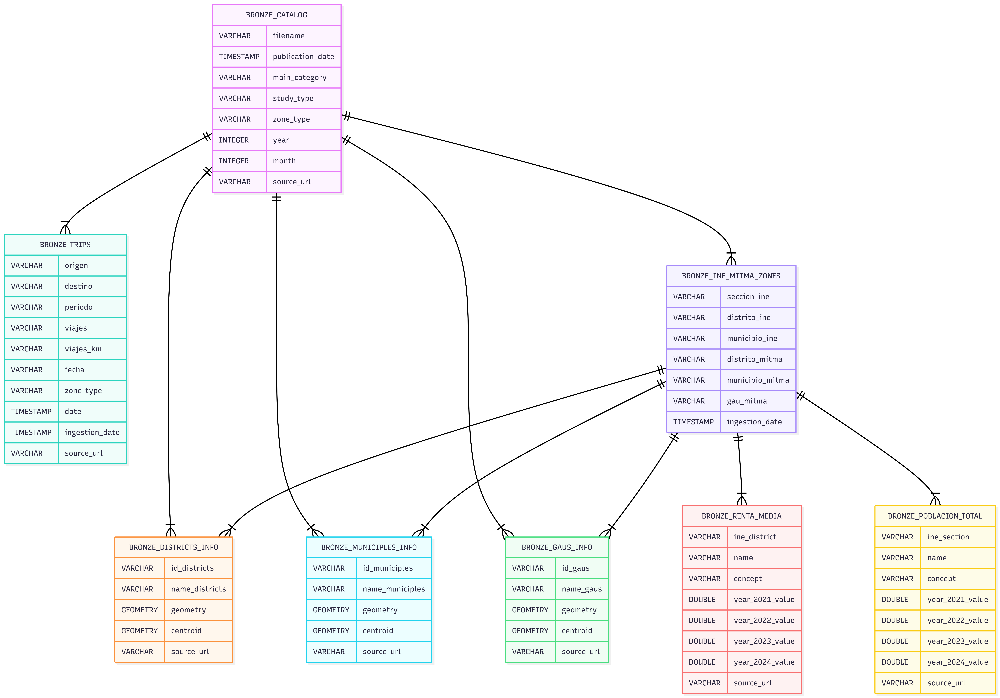
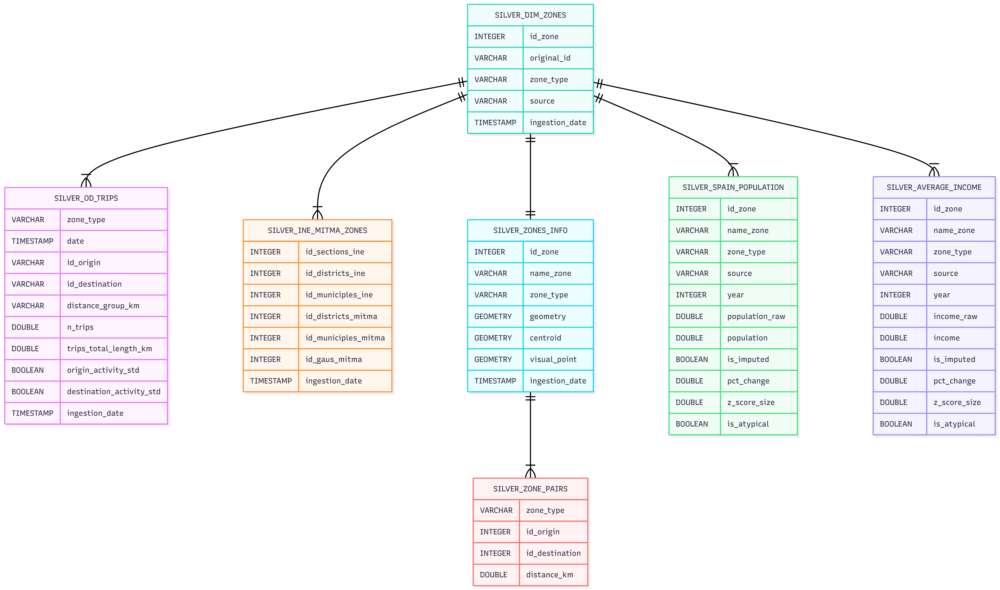
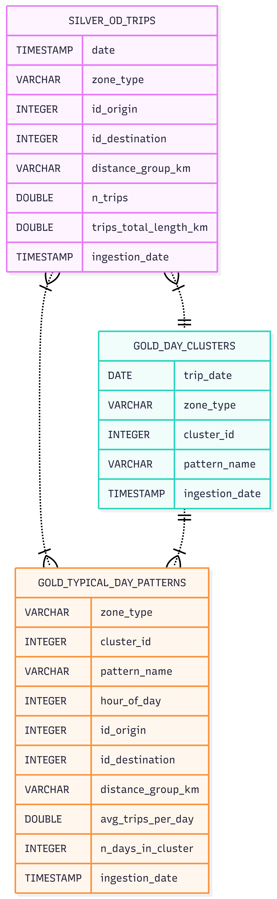

## Authors
**Ainara Menendez Martin & Jorge Peris Belenguer**

## Abstract
This project consists of designing and implementing a 3-tier Data Lakehouse architecture to ingest, process, and analyze mobility data from the Spanish Ministry of Transport and Sustainable Mobility (MITMA). The primary objective is to create a robust and scalable data infrastructure that supports transport domain experts in obtaining insights for urban mobility and planning.

The architecture follows a decoupled "DuckLake" model, utilizing DuckDB as the core OLAP engine, AWS S3 for storage, and AWS EC2/Batch for compute, all orchestrated by Apache Airflow .

## Architecture and Methodology
The project adopts a Lakehouse paradigm that organizes data flow into three stages of progressive refinement to ensure quality and traceability.

### Bronze Layer (Raw)
The Bronze layer ingests and stores mobility and demographic data in its original format to maintain an immutable history. It handles the ingestion of MITMA mobility matrices and INE socio-economic indicators using a catalog-based approach.

### Silver Layer (Trusted)
In the Silver layer, data is cleaned, validated, and enriched to impose a consistent structure. A critical component of this layer is the creation of a master `dim_zones` table, which maps and unifies disparate zone codes from MITMA and INE into a consistent internal ID, enabling seamless integration between sources .

### Gold Layer (Curated)
The Gold layer contains aggregated, business-ready data products designed to answer specific business questions. It utilizes complex transformations and aggregations to produce analytical insights.

## Business Questions
The analytics layer addresses two primary use cases:

**1. Typical Day Analysis**
* **Objective:** To characterize daily mobility patterns across different zones.
**Approach:** Aggregation of trips by day and hour, followed by K-Means clustering to classify days into distinct patterns: "Weekday," "Weekend," or "Holiday".

**2. Infrastructure Gaps Analysis**
* **Objective:** To identify areas where transport infrastructure fails to meet potential demand.
* **Approach:** Implementation of a Gravity Model ($T_{ij} = k \cdot P_i \cdot E_j / d_{ij}^{power}$) to predict theoretical demand.This is compared against observed trips to calculate Mismatch Ratios and absolute Gaps .

## Technologies
* **Database:** DuckDB
* **Orchestration:** Apache Airflow (Dockerized)
* **Cloud Storage:** AWS S3 (Parquet format)
* **Compute:** AWS EC2 (Spot Instances) & AWS Batch
* **Metadata Management:** Neon Postgres
* **Languages:** Python, SQL

## Conclusions
The development of this project followed a methodology characterized by iterative trial and error, underscoring the significant challenge of designing a database architecture capable of efficiently processing and storing massive volumes of mobility data[cite: 1347]. [cite_start]Navigating the complexities of the big data framework provided a steep but invaluable learning curve, particularly in mastering industry-standard tools for orchestration, such as Apache Airflow, and implementing cloud computing strategies using AWS S3 and Batch to decouple storage from compute[cite: 1348]. [cite_start]Ultimately, despite these technical hurdles, we successfully delivered a robust 3-tier architecture, leveraging the cutting-edge capabilities of the emerging DuckLake platform to build a Data Lakehouse capable of supporting large amounts of data and use cases in transportation analysis.
